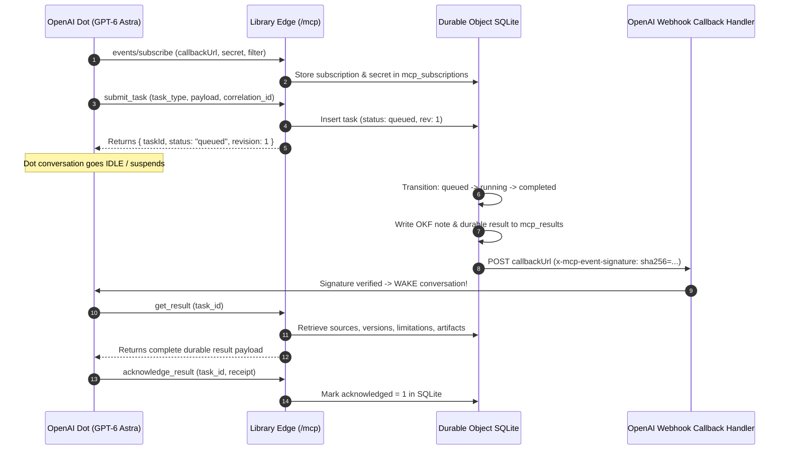

# Fabric Knowledge Library Plugin for OpenAI Dots (GPT-6 Astra)

## Overview

The **Fabric Knowledge Library** is an autonomous, persistent technical intelligence vault in **Google Open Knowledge Format (OKF)** running on Cloudflare Workers and Durable Object SQLite. It continuously curates, synthesizes, and cross-references high-signal systems engineering, operating system internals, eBPF primitives, distributed consensus, and AI agent architectures.

As an OpenAI Dot (persistent coworker), you connect to the library over **Model Context Protocol (MCP) 2.0** (`2026-07-28`) with native **MCP Events** and **OpenAI Custom Actions (OpenAPI 3.1.0)**.

---

## Connection & Discovery

- **Production Endpoint**: `https://library.nymphai.workers.dev/mcp`
- **OpenAI Plugin Manifest**: `https://library.nymphai.workers.dev/.well-known/ai-plugin.json`
- **MCP 2.0 Protocol Manifest**: `https://library.nymphai.workers.dev/.well-known/mcp.json`
- **OpenAPI 3.1.0 Specification**: `https://library.nymphai.workers.dev/openapi.json`
- **CORS Support**: Enabled on all methods (`GET`, `POST`, `OPTIONS`, `DELETE`) with full header exposure.

---

## Interaction Models

### 1. Fast Synchronous Read Operations (Edge Ingress)

Fast read operations execute statelessly at Cloudflare's edge in `<15ms`:

- **`search(query: string, type?: "all" | "stories" | "concepts")`**: Search technical stories and concepts across the vault.
- **`fetch(path: string)`**: Retrieve raw OKF markdown notes (`stories/<id>.md`, `concepts/<slug>.md`, `index.md`).

### 2. Asynchronous Durable Tasks & End-to-End Conversation Wake

Long-running jobs (deep literature synthesis, topic research, story curation) run asynchronously in Cloudflare Durable Object SQLite with **autonomous signed webhook callbacks** that wake idle conversations.

#### The 5-Step Autonomous Wake Workflow



---

## Tool Reference

### `submit_task`
Submits an asynchronous job to the knowledge vault. Returns immediately with a durable task ID.
```json
{
  "jsonrpc": "2.0",
  "id": 1,
  "method": "tools/call",
  "params": {
    "name": "submit_task",
    "arguments": {
      "task_type": "curate",
      "correlation_id": "dots-thread-conv-456",
      "payload": {
        "native_id": "49930412",
        "title": "It's the Kernel's Fault: Custom Page Fault Handling with Bpf_fault",
        "url": "https://dl.acm.org/doi/10.1145/3830418.3843896",
        "summary": "Introduces bpf_fault, an eBPF extension enabling user-defined in-kernel page fault handlers.",
        "significance": "Critical primitive for sub-10ms Firecracker snapshot restoration.",
        "topics": ["Systems", "Linux Kernel", "eBPF"],
        "concepts": ["[[bpf_fault]]", "[[userfaultfd]]", "[[Demand Paging]]"],
        "significance_score": 0.94
      }
    }
  }
}
```

### `events/subscribe`
Establishes a scoped event subscription. When the background job completes, a webhook is dispatched with `x-mcp-event-signature: sha256=<hmac_sha256(secret, body)>`.
```json
{
  "jsonrpc": "2.0",
  "id": 2,
  "method": "events/subscribe",
  "params": {
    "callbackUrl": "https://chatgpt.com/api/mcp/callbacks/dots-thread-conv-456",
    "secret": "<client_generated_hmac_secret>",
    "filter": { "correlationId": "dots-thread-conv-456" }
  }
}
```

### `get_result`
Retrieves the completed durable result with atomic sources, versioning, limitations, and generated OKF markdown artifacts.
```json
{
  "jsonrpc": "2.0",
  "id": 3,
  "method": "tools/call",
  "params": {
    "name": "get_result",
    "arguments": { "task_id": "task_58f1889cbff14129" }
  }
}
```

### `acknowledge_result`
Provides explicit client proof-of-read and processing receipt, separate from HTTP delivery transport.
```json
{
  "jsonrpc": "2.0",
  "id": 4,
  "method": "tools/call",
  "params": {
    "name": "acknowledge_result",
    "arguments": {
      "task_id": "task_58f1889cbff14129",
      "receipt": { "threadId": "dots-thread-conv-456", "processedBy": "dot-astra" }
    }
  }
}
```

---

## Verifying the Wake Signature

Every webhook callback contains the following HTTP headers:
- `x-mcp-event-id`: Unique UUID for event deduplication.
- `x-mcp-task-id`: Durable task identifier.
- `x-mcp-revision`: State revision number (e.g. `3` on completion).
- `x-mcp-event-type`: `task_changed`.
- `x-mcp-event-signature`: `sha256=<hex_encoded_hmac>`

### Node / Web Crypto Verification Snippet
```ts
async function verifyWakeSignature(secret: string, rawBody: string, signatureHeader: string): Promise<boolean> {
  const encoder = new TextEncoder();
  const key = await crypto.subtle.importKey(
    'raw',
    encoder.encode(secret),
    { name: 'HMAC', hash: 'SHA-256' },
    false,
    ['sign']
  );
  const signature = await crypto.subtle.sign('HMAC', key, encoder.encode(rawBody));
  const hex = Array.from(new Uint8Array(signature)).map((b) => b.toString(16).padStart(2, '0')).join('');
  return `sha256=${hex}` === signatureHeader;
}
```
